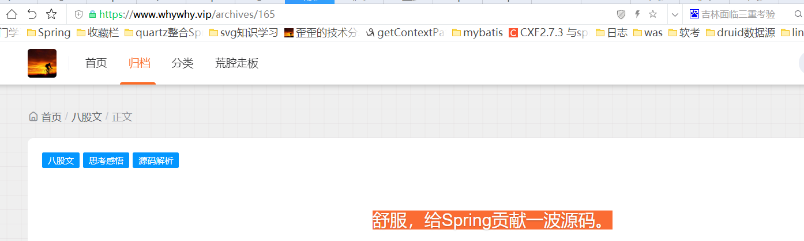

该项目主要为改写@Async 不支持el表达式，通过修改源码支持 详见why技术讲解  
@Async(value="${thread-pool.name}")
https://www.whywhy.vip/archives/165 舒服，给Spring贡献一波源码。  
通过评论 学会一种不用编译源码，修改源码的技巧。在本项目中，新建一个源码路径相同的包，然后将修改的类放到目录下，直接修改类即可。  
打包会将源码中的同类给覆盖，直接使用我们自己的逻辑。  

